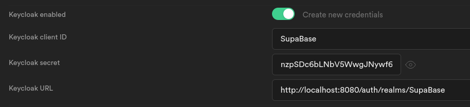
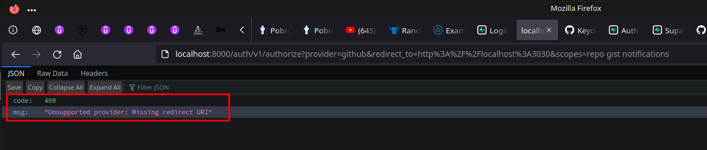
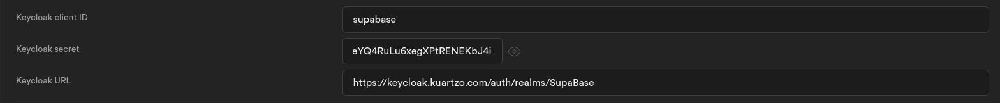

# NOTES

## TLDR

postgres created user

- mario???????@gmail.com
- ???w?b???

## Links

- [Project, Setup &amp; Integration feat. Next.js](https://aalam.in/blog/supabase-auth-intro-setup-next)

- [Advanced Features: Debugging | Next.js](https://nextjs.org/docs/advanced-features/debugging)

## SupaBase Project Details

Get Details from [Api Settings](https://app.supabase.com/project/agtwhwsxgdjudvmebpts/settings/api)

Project URL:
  https://???????????.supabase.co

Project API keys:
  anon | public: eyJhbGciOiJIUzI1NiIsInR5cCI6IkpXVCJ9....

  service_role | secret: eyJhbGciOiJIUzI1NiIsInR5cCI6IkpXVCJ9....

and use it in `env.local` ex

```shell
NEXT_PUBLIC_SUPABASE_URL=https://???????????.supabase.co
NEXT_PUBLIC_SUPABASE_KEY=eyJhbGciOiJIUzI1NiIsInR5cCI6IkpXVCJ9....
```

## How

### Enabled Show error on Repeated User

- [auth.signUp() doesn&#39;t error for existing accounts - security vulnerability · Issue #296 · supabase/supabase-js](https://github.com/supabase/supabase-js/issues/296)

uncheck **Enable email confirmations** on Authentication settings

### Enable Semi

- [ESLint &#038; Prettier: Enable semi option without complaints - 枫华](https://www.sinocalife.com/eslint-prettier-enable-semi-option-without-complaints)

`.eslintrc.js`

with this it won't remove semi on save with eslint

```js
  rules: {
    'prettier/prettier': [
      'error',
      // the trick to enable semi on save is just use semi: true bellow
      { semi: true },
```

and change `semi: true` on `.prettierrc.js`, with this we can use `npm run prettier` to format whole project adding semi to all files

`.prettierrc.js`

```js
module.exports = {
  semi: true,
};
```

## GitHub OAUth2 Application


Client ID: 42851f570f2a...........
Client Secret: 31fd5482299faf6...........

## Add Keycloak Integration

- [Login with Keycloak | Supabase](https://supabase.com/docs/guides/auth/auth-keycloak)

### Without Docker Compose

- [Docker Hub](https://hub.docker.com/r/jboss/keycloak/)
#### PostgreSQL Example

Create a user defined network

```shell
$ docker network create keycloak-network
```

#### Start a PostgreSQL instance

First start a PostgreSQL instance using the PostgreSQL docker image:

```shell
$ docker run -d --name postgres --net keycloak-network -e POSTGRES_DB=keycloak -e POSTGRES_USER=keycloak -e POSTGRES_PASSWORD=password postgres
```

#### Start a Keycloak instance

Start a Keycloak instance and connect to the PostgreSQL instance:

```shell
$ docker run --name keycloak --net keycloak-network jboss/keycloak -e DB_USER=keycloak -e DB_PASSWORD=password
```

If you used a different name for the PostgreSQL instance to postgres you need to specify the DB_ADDR environment variable.

### With Docker Compose

- [keycloak-containers/keycloak-postgres.yml at main · keycloak/keycloak-containers](https://github.com/keycloak/keycloak-containers/blob/main/docker-compose-examples/keycloak-postgres.yml)

check `docker-compose.yml` file

```shell
$ docker-compose up -d
```

<http://localhost:8080>

- KEYCLOAK_USER: admin
- KEYCLOAK_PASSWORD: Pa55w0rd



issuer: http://localhost:8080/auth/realms/SupaBase
The issuer will be used as the **Keycloak URL**

client id: SupaBase
The "Client ID" of the created client will serve as the client_id when you make API calls to authenticate the user.

Valid Redirect URIs
http://localhost:9999/callback
https://agtwhwsxgdjudvmebpts.supabase.co/auth/v1/callback

`http://localhost:9999/callback` is the local gotrue instance, running on permise

client_secret: VFNzhF6nzpSDc6bLNbV5WwgJNywf6zJy

### Keycloak Errors

- [Keycloak Login results in Error: &quot;Unable to exchange external code&quot; · Issue #516 · supabase/gotrue](https://github.com/supabase/gotrue/issues/516)
- [Third party auth login: &quot;Unable to exchange external code: &lt;code&gt;&quot; · Discussion #1192 · supabase/supabase](https://github.com/supabase/supabase/discussions/1192)

wip....

keycloak errror Unable+to+exchange+external+code
- [Keycloak Login results in Error: &quot;Unable to exchange external code&quot; · Issue #516 · supabase/gotrue](https://github.com/supabase/gotrue/issues/516)
because of wrong secret in supabase hosted ????
http://localhost:3030/?error=server_error&error_description=Unable+to+exchange+external+code%3A+e6eefb72-dd75-447b-879d-231d4937c065.b97230b5-c617-4379-9334-cfdb3fe0905c.dfae8b4b-e82d-466c-ac57-d112d9b92d7c


curl -s localhost:9999/settings | jq .external
{
  "apple": false,
  "azure": false,
  "bitbucket": false,
  "discord": false,
  "github": true,
  "gitlab": false,
  "google": false,
  "linkedin": false,
  "facebook": false,
  "notion": false,
  "spotify": false,
  "slack": false,
  "twitch": false,
  "twitter": false,
  "email": true,
  "phone": true,
  "saml": false,
  "zoom": false
}

seems that keycloak is not in providers

supabase/gotrue:v2.5.21 > supabase/gotrue:v2.7.2




fixed adding 
GOTRUE_EXTERNAL_GITHUB_REDIRECT_URI: "http://localhost:3030"


error=redirect_uri_mismatch&error_description=The+redirect_uri+MUST+match+the+registered+callback+URL+for+this+application.


keycloak with hosted self and self hosted
Unable to exchange external code: a43362ef-dfb7-4df8-b955-ea87b5be320e.0f80452a-f3ab-4c94-97ea-56c789dcb819.dfae8b4b-e82d-466c-ac57-d112d9b92d7c


```shell
$ docker-compose down && docker-compose up -d && docker-compose logs -f auth
```

time="2022-07-08T22:42:19Z" level=error msg="500: Unable to exchange external code: 5da827e7-fcee-46c5-a3c3-f5e908a9f89f.ea289a44-b80e-4c24-b48c-1d0747266cfe.234c8eb6-706a-4083-814e-56a1a514e557" component=api error="Post \"http://localhost:8080/auth/realms/SupaBase/protocol/openid-connect/token\": dial tcp 127.0.0.1:8080: connect: connection refused" method=GET path=/callback referer= remote_addr="192.168.128.1:51720" request_id=f9b52284-7721-475b-a379-c552c978fec9

http://localhost:8080/auth/realms/SupaBase

```json
{
  "realm": "SupaBase",
  "public_key": "MIIBIjANBgkqhkiG9w0BAQEFAAOCAQ8AMIIBCgKCAQEAllKy7UPI9i1x9O4OPvOtWSE4DM1kmuQUZVa7rOS5yR02HY5nF3acPn2Bx0RP7ZjAdyaQKaU2umvLPIXYKESVjZhlgEwHLi3u8jx6fecJo0BbgMXpKxiAczqGNVqdXjea7L5G87Jpeo1G/EwjpANJL3FtbHMfsY2kqTcJnOzQT0McLr4cD5c1Bpsh8FI6pQSs+QLbhd0V42ANaOnXpg0l+0rX0uWdoSUbM28DnMb442+0+X3eQKN0FLYRFBg3MgaELViSQB3iqVkCGxtcJOOCmUC8CnjZ2g2kIbXcWUt6kEape9L7Edj1lu6tSUFjZgtNIHd1fOlD4+R/JA74kgh71wIDAQAB",
  "token-service": "http://localhost:8080/auth/realms/SupaBase/protocol/openid-connect",
  "account-service": "http://localhost:8080/auth/realms/SupaBase/account",
  "tokens-not-before": 0
}
```

adding keycloak to supabase stack now it connects and exchange code

supabase-auth | time="2022-07-08T22:54:18Z" level=info msg="request started" component=api method=GET path=/authorize referer="http://localhost:3030/" remote_addr="192.168.224.1:46474" request_id=88add4ea-095c-40eb-b48e-f5feb7e9155e
supabase-auth | time="2022-07-08T22:54:18Z" level=info msg="Redirecting to external provider" component=api method=GET path=/authorize provider=keycloak referer="http://localhost:3030/" remote_addr="192.168.224.1:46474" request_id=88add4ea-095c-40eb-b48e-f5feb7e9155e
supabase-auth | time="2022-07-08T22:54:18Z" level=info msg="request completed" component=api duration=261315 method=GET path=/authorize referer="http://localhost:3030/" remote_addr="192.168.224.1:46474" request_id=88add4ea-095c-40eb-b48e-f5feb7e9155e status=302

but now lands in a keycloak page not found


supabase-keycloak | 00:05:21,635 WARN  [org.keycloak.models.utils.RepresentationToModel] (default task-3) Referenced client scope 'acr' doesn't exist. Ignoring
supabase-keycloak | 00:06:30,760 WARN  [org.keycloak.services] (default task-6) KC-SERVICES0091: Request is missing scope 'openid' so it's not treated as OIDC, but just pure OAuth2 request.
supabase-keycloak | 00:06:40,453 WARN  [org.keycloak.events] (default task-6) type=LOGIN_ERROR, realmId=SupaBase, clientId=supabase, userId=efa7afbb-adc5-42ec-8c86-2ab5b5d94931, ipAddress=192.168.96.1, error=invalid_user_credentials, auth_method=openid-connect, auth_type=code, redirect_uri=https://agtwhwsxgdjudvmebpts.supabase.co/auth/v1/callback, code_id=df585fe1-96d5-4644-9cf5-0868974ec708, username=mario, authSessionParentId=df585fe1-96d5-4644-9cf5-0868974ec708, authSessionTabId=i3SJJL0-uNc


- [How to access host port from docker container](https://stackoverflow.com/questions/31324981/how-to-access-host-port-from-docker-container)

```shell
$ ip addr show docker0 | grep -Po 'inet \K[\d.]+'
```


keycloak user required mail else it crashs
ex marioammonteiro@gmail.com

ENABLE_EMAIL_AUTOCONFIRM=true
must be true else smtp fails and fails oauth login

on hosted
change details and RESTART INSTANCE else

error_description
	Unable to exchange external code: 01983613-6f52-463f-b757-0a08e1b224d8.ed3a41d4-41a3-4f57-8e6f-ecf437f41b4b.07182b43-bb2b-4957-a0a8-84239ddefd3a
  check client secret in keycloak and supabase
  keycloak logs
  supabase-keycloak  | 23:38:53,987 WARN  [org.keycloak.events] (default task-39) type=CODE_TO_TOKEN_ERROR, realmId=SupaBase, clientId=supabase, userId=null, ipAddress=18.133.225.233, error=invalid_client_credentials, grant_type=authorization_code


http://localhost:3030/#error=unauthorized_client&error_code=401&error_description=Unverified+email+with+keycloak
check verified mail is users  


final hosted working version

