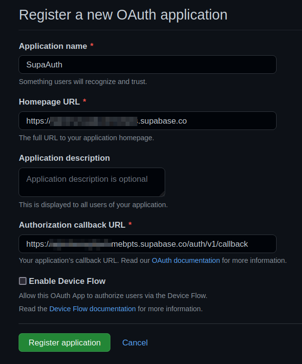
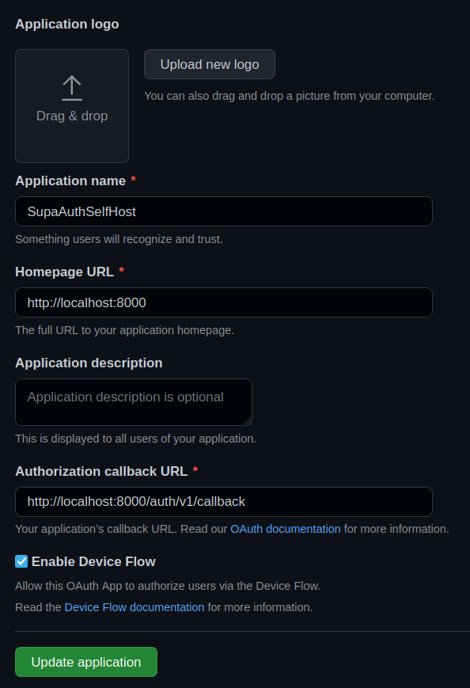
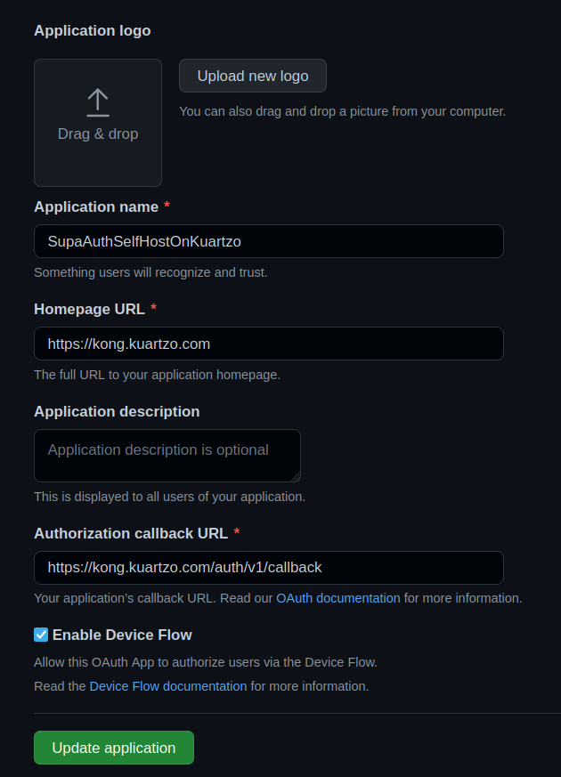
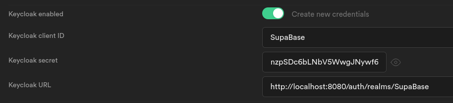

# NOTES

- [NOTES](#notes)
  - [TLDR](#tldr)
  - [Links](#links)
  - [SupaBase Project Details](#supabase-project-details)
  - [How](#how)
    - [Enabled Show error on Repeated User](#enabled-show-error-on-repeated-user)
    - [Enable Semi](#enable-semi)
  - [GitHub OAUth2 Application SupaBase Hosted](#github-oauth2-application-supabase-hosted)
  - [GitHub OAUth2 Application SupaBase SelfHosted](#github-oauth2-application-supabase-selfhosted)
  - [GitHub OAUth2 Application SupaBase SelfHosted on Kuartzo](#github-oauth2-application-supabase-selfhosted-on-kuartzo)
  - [Add Keycloak Integration](#add-keycloak-integration)
    - [Without Docker Compose](#without-docker-compose)
      - [PostgreSQL Example](#postgresql-example)
      - [Start a PostgreSQL instance](#start-a-postgresql-instance)
      - [Start a Keycloak instance](#start-a-keycloak-instance)
    - [With Docker Compose](#with-docker-compose)
    - [Supabase Keycloak Errors](#supabase-keycloak-errors)
      - [Keycloak Login results in Error: "Unable to exchange external code" #516](#keycloak-login-results-in-error-unable-to-exchange-external-code-516)
      - [Keycloak user required valid email and verified email](#keycloak-user-required-valid-email-and-verified-email)
      - [GoTrue required ENABLE_EMAIL_AUTOCONFIRM true to prevent sent mail and crash on SMTP connect to localhost:53](#gotrue-required-enable_email_autoconfirm-true-to-prevent-sent-mail-and-crash-on-smtp-connect-to-localhost53)
      - [Invalid Keycloak supabase Client Secret](#invalid-keycloak-supabase-client-secret)

## TLDR

postgres created user

- mario???????@gmail.com
- ???w?b???

## Links

- [Project, Setup &amp; Integration feat. Next.js](https://aalam.in/blog/supabase-auth-intro-setup-next)

- [Advanced Features: Debugging | Next.js](https://nextjs.org/docs/advanced-features/debugging)

## SupaBase Project Details

Get Details from [Api Settings](https://app.supabase.com/project/agtwhwsxgdjudvmebpts/settings/api)

Project URL:
  https://???????????.supabase.co

Project API keys:
  anon | public: eyJhbGciOiJIUzI1NiIsInR5cCI6IkpXVCJ9....

  service_role | secret: eyJhbGciOiJIUzI1NiIsInR5cCI6IkpXVCJ9....

and use it in `env.local` ex

```shell
NEXT_PUBLIC_SUPABASE_URL=https://???????????.supabase.co
NEXT_PUBLIC_SUPABASE_KEY=eyJhbGciOiJIUzI1NiIsInR5cCI6IkpXVCJ9....
```

## How

### Enabled Show error on Repeated User

- [auth.signUp() doesn&#39;t error for existing accounts - security vulnerability · Issue #296 · supabase/supabase-js](https://github.com/supabase/supabase-js/issues/296)

uncheck **Enable email confirmations** on Authentication settings

### Enable Semi

- [ESLint &#038; Prettier: Enable semi option without complaints - 枫华](https://www.sinocalife.com/eslint-prettier-enable-semi-option-without-complaints)

`.eslintrc.js`

with this it won't remove semi on save with eslint

```js
  rules: {
    'prettier/prettier': [
      'error',
      // the trick to enable semi on save is just use semi: true bellow
      { semi: true },
```

and change `semi: true` on `.prettierrc.js`, with this we can use `npm run prettier` to format whole project adding semi to all files

`.prettierrc.js`

```js
module.exports = {
  semi: true,
};
```

## GitHub OAUth2 Application SupaBase Hosted

- [SupaAuth](https://github.com/settings/applications/1941479)



Client ID: 42851f570f2a...........
Client Secret: 31fd5482299faf6...........

## GitHub OAUth2 Application SupaBase SelfHosted

- [SupaAuthSelfHost](https://github.com/settings/applications/1945830)



## GitHub OAUth2 Application SupaBase SelfHosted on Kuartzo

- [SupaAuthSelfHostOnKuartzo](https://github.com/settings/applications/1954191)

- 

## Add Keycloak Integration

- [Login with Keycloak | Supabase](https://supabase.com/docs/guides/auth/auth-keycloak)

### Without Docker Compose

- [Docker Hub](https://hub.docker.com/r/jboss/keycloak/)
#### PostgreSQL Example

Create a user defined network

```shell
$ docker network create keycloak-network
```

#### Start a PostgreSQL instance

First start a PostgreSQL instance using the PostgreSQL docker image:

```shell
$ docker run -d --name postgres --net keycloak-network -e POSTGRES_DB=keycloak -e POSTGRES_USER=keycloak -e POSTGRES_PASSWORD=password postgres
```

#### Start a Keycloak instance

Start a Keycloak instance and connect to the PostgreSQL instance:

```shell
$ docker run --name keycloak --net keycloak-network jboss/keycloak -e DB_USER=keycloak -e DB_PASSWORD=password
```

If you used a different name for the PostgreSQL instance to postgres you need to specify the DB_ADDR environment variable.

### With Docker Compose

- [keycloak-containers/keycloak-postgres.yml at main · keycloak/keycloak-containers](https://github.com/keycloak/keycloak-containers/blob/main/docker-compose-examples/keycloak-postgres.yml)

check `docker-compose.yml` file

```shell
$ docker-compose up -d
```

<http://localhost:8080>

- KEYCLOAK_USER: admin
- KEYCLOAK_PASSWORD: Pa55w0rd



issuer: http://localhost:8080/auth/realms/SupaBase
The issuer will be used as the **Keycloak URL**

client id: SupaBase
The "Client ID" of the created client will serve as the client_id when you make API calls to authenticate the user.

Valid Redirect URIs
http://localhost:9999/callback
https://agtwhwsxgdjudvmebpts.supabase.co/auth/v1/callback

`http://localhost:9999/callback` is the local gotrue instance, running on permise

client_secret: VFNzhF6nzpSDc6bLNbV5WwgJNywf6zJy

### Supabase Keycloak Errors

occur with hosted and self hosted

####  Keycloak Login results in Error: "Unable to exchange external code" #516 

- [Keycloak Login results in Error: &quot;Unable to exchange external code&quot; · Issue #516 · supabase/gotrue](https://github.com/supabase/gotrue/issues/516)

> issue that I participate and have some insights

- [Third party auth login: &quot;Unable to exchange external code: &lt;code&gt;&quot; · Discussion #1192 · supabase/supabase](https://github.com/supabase/supabase/discussions/1192)

this error can occurs because of a lot of things, better to see logs

- gotrue cant't connect to localhost:8080
- wrong keycloak client secret
- login user don't have email
- login user email is not Verified
- smtp fails to send mail

check if keycloak provider exists, seem not

```
$ curl -s localhost:9999/settings | jq .external
{
  "apple": false,
  "azure": false,
  "bitbucket": false,
  "discord": false,
  "github": true,
  "gitlab": false,
  "google": false,
  "linkedin": false,
  "facebook": false,
  "notion": false,
  "spotify": false,
  "slack": false,
  "twitch": false,
  "twitter": false,
  "email": true,
  "phone": true,
  "saml": false,
  "zoom": false
}
```

seems that keycloak is not in providers

change `supabase/gotrue:v2.5.21` version to `supabase/gotrue:v2.7.2` in `docker-compose.yml`

double check

```shell
$ curl -s localhost:9999/settings | jq .external
{
  "github": true,
  "keycloak": true,
  "email": true,
  "phone": true,
}
```

start fix **Unable to exchange external code** keycloak with hosted self and self hosted

```shell
# log containers
$ docker-compose logs -f auth keycloak
# outcome
time="2022-07-08T22:42:19Z" level=error msg="500: Unable to exchange external code: 5da827e7-fcee-46c5-a3c3-f5e908a9f89f.ea289a44-b80e-4c24-b48c-1d0747266cfe.234c8eb6-706a-4083-814e-56a1a514e557" component=api error="Post \"http://localhost:8080/auth/realms/SupaBase/protocol/openid-connect/token\": dial tcp 127.0.0.1:8080: connect: connection refused" method=GET path=/callback referer= remote_addr="192.168.128.1:51720" request_id=f9b52284-7721-475b-a379-c552c978fec9
```

gotrue container trying to connect to keycloak ate localhost:8080, obvious it will never work

try with host machine docker network ip

- [How to access host port from docker container](https://stackoverflow.com/questions/31324981/how-to-access-host-port-from-docker-container)

```shell
$ ip addr show docker0 | grep -Po 'inet \K[\d.]+'
```

it works

#### Keycloak user required valid email and verified email

keycloak user required mail else it crashs
ex marioammonteiro@gmail.com

<http://localhost:3030/#error=unauthorized_client&error_code=401&error_description=Unverified+email+with+keycloak>
#### GoTrue required ENABLE_EMAIL_AUTOCONFIRM true to prevent sent mail and crash on SMTP connect to localhost:53

change `ENABLE_EMAIL_AUTOCONFIRM=false` to `ENABLE_EMAIL_AUTOCONFIRM=true`

#### Invalid Keycloak supabase Client Secret

```
error_description
	Unable to exchange external code: 01983613-6f52-463f-b757-0a08e1b224d8.ed3a41d4-41a3-4f57-8e6f-ecf437f41b4b.07182b43-bb2b-4957-a0a8-84239ddefd3a
  check client secret in keycloak and supabase
  keycloak logs
  supabase-keycloak  | 23:38:53,987 WARN  [org.keycloak.events] (default task-39) type=CODE_TO_TOKEN_ERROR, realmId=SupaBase, clientId=supabase, userId=null, ipAddress=18.133.225.233, error=invalid_client_credentials, grant_type=authorization_code
```

lost track of this error